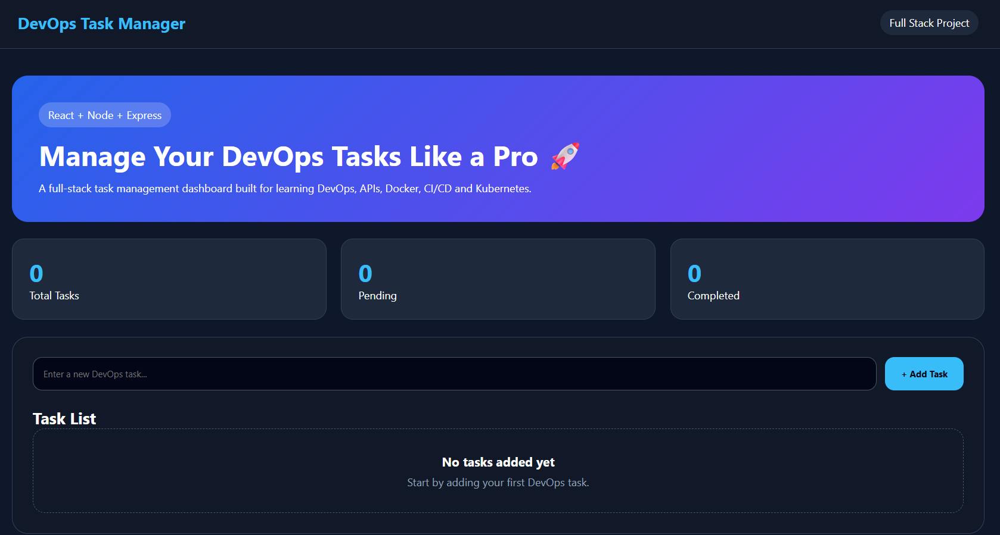

# DevOps Task Manager

A full-stack task management application built using React, Node.js, and Express.

## Features

* Add Tasks
* Delete Tasks
* REST API Integration
* React Frontend
* Express Backend
* Responsive UI
* Full CRUD Roadmap
* MongoDB Integration (Upcoming)
* Authentication (Upcoming)
* Docker Support (Upcoming)
* CI/CD Pipeline (Upcoming)
* Kubernetes Deployment (Upcoming)

## Tech Stack

### Frontend

* React
* Vite
* CSS

### Backend

* Node.js
* Express.js
* CORS

## Project Structure

```
DevOps-Task-Manager/
│
├── frontend/
│   ├── src/
│   └── public/
│
├── backend/
│   ├── routes/
│   ├── controllers/
│   └── server.js
│
└── README.md
```

## Installation

### Clone Repository

```bash
git clone https://github.com/karankumar-tech-eng/DevOps-Task-Manager.git
```

### Frontend

```bash
cd frontend
npm install
npm run dev
```

### Backend

```bash
cd backend
npm install
npm run dev
```
## Project Screenshot



## Current Progress

✅ React Frontend

✅ Express Backend

✅ Add Task API

✅ Delete Task API

✅ Frontend Connected with Backend

🔄 MongoDB Integration

🔄 Authentication

🔄 Docker

🔄 GitHub Actions

🔄 Kubernetes

## Author

Karan Kumar
